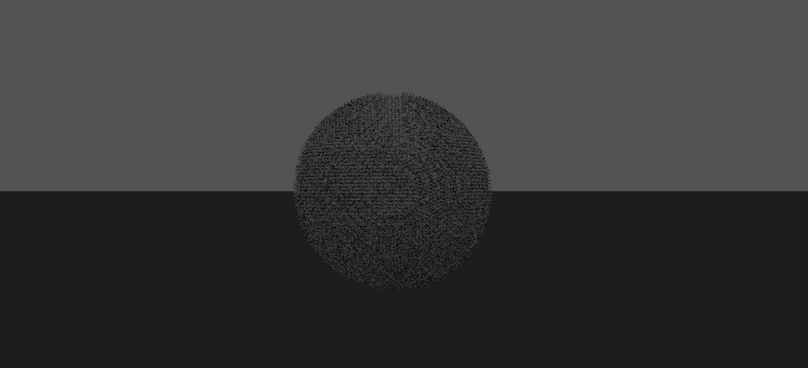

# MarchingCubes

*参考论文：Lorensen W E ,  Cline H E . Marching cubes: A high resolution 3D surface construction algorithm*

这个项目简单实现了MarchingCubes的基础思想：构建立方体，通过立方体八个角的数值来确定给定等值面在立方体内形成的三角面。

项目的主要思路为：
- 获取球形物体的切片数据
- 利用MarchingCubes算法还原切片数据的三维形状
- 将三维形状导出文件

本项目得到的[三维文件](./my_vertex.txt)为[minilight](https://www.hxa.name/minilight/)需要的数据类型，也由其lua版本渲染得到下图

